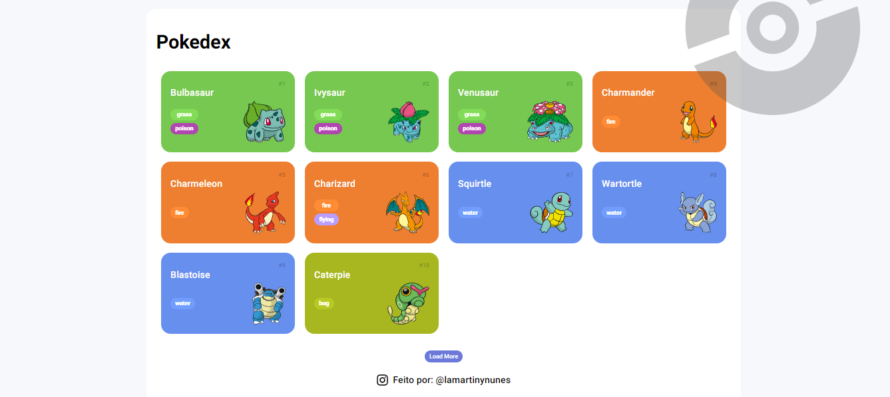

# Trilha JS Developer - Pokedex

Projeto de construção de uma Pokedex com Javascript proposto em um curso do Santander Bootcamp 2023 - Fullstack Java+Angular (DIO)

Pokedex criada utilizando a fetch nativo do JavaScript para buscar as informações da PokeAPI, que é uma API com todas as informações sobre pokemon.

## Tecnologias usadas:

- HTML5
- CSS3
- JavaScript
  - FetchAPI
  - Promise
  - Classes

